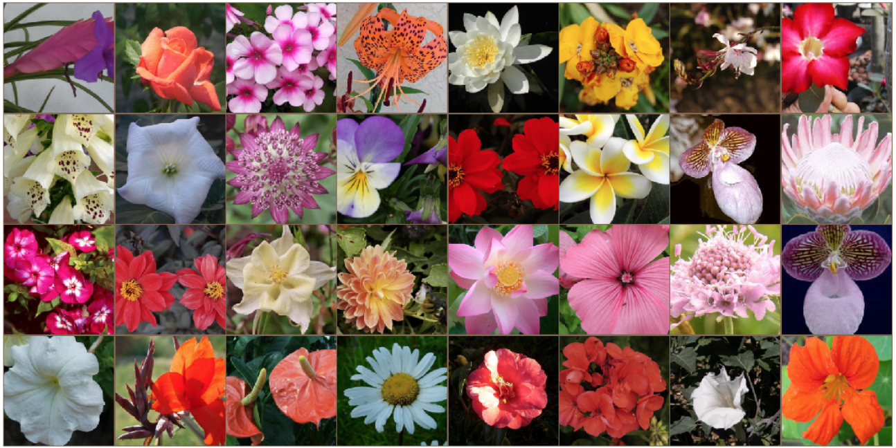
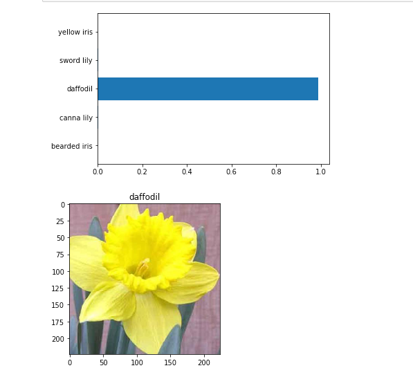

# flower-classifier-neural-network
Final project in Udacity "AI programming with Python" Nanodegree 

### Project description
This is the code for a neural network that works as a flowers classifier (recognizing 102 different classes of flowers)
The code language is Python, it was created in a [Jupyter notebook](Flowers_-_Image_Classifier_Project.ipynb) using Pytorch. The model was trained on GPU using an altered pre-trained model VGG16 and has reached a 0.29 valid loss with a best valid accuracy of 0.927 after 6 epochs.

There are also three Python files that turn the model to an app with different parameters to play with (such as the pre-trained model, epochs, learning rate and more and test the results. 

The project was the final assigment in Udacity great course Nanodegree "AI programming with Python". (If you're a student, you can look for inspiration but don't copy&paste parts of the code. It won't benefit you)

